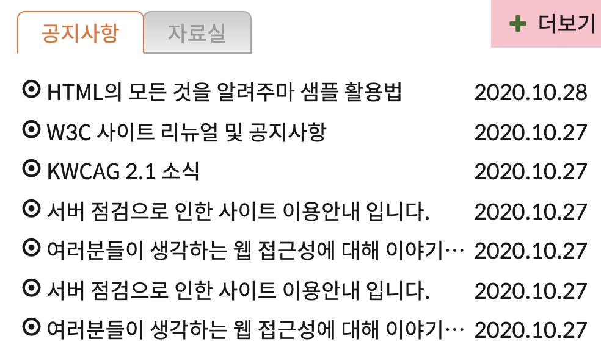
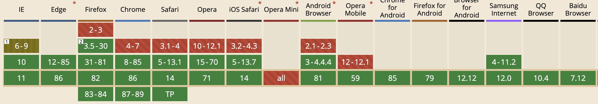

> 오늘은 여기저기 많이 쓰이고 있는 탭 구조 형식의 게시판을 직접 설계하고 만들어보았다. 처음 시도했을시에는 시멘틱 마크업을 어느정도 지키면서 설계를 했지만 논리적인 순서를 지키지 않았다. 바로 코드 실행에 옮기는것보단 논리적인 순서를 최우선적으로 생각하고 그에 알맞게 시멘틱 마크업과 적절한 네이밍을 주는 연습을 더 해야할듯하다.


## 게시판 (탭 구조)



<br>
<br>


논리적인 마크업이라는 개념을 배우기 전에 이 구조를 설계해야했다면 아마 공지사항, 자료실 더보기란을 `ul`로 묶고 아래 목록들도 `ul`로 묶어서 배치하는 방식으로 만들었을것같다. 하지만 논리적인 관점으로 봤을때 공지사항 `heading`과 목록들은 형제요소로 같이 배치되어야 한다고 판단했기때문에 공지사항, 자료실 각 두개의 `section`을 만들어 그안에 각자의 `heading`과 목록들을 배치하는 식으로 시작했다. 

여기서 조금 아쉬웠던 점은 더보기란의 마크업 순서를 생각하지 못했던것같다. 논리적인 관점에서 더보기란은 목록뒤에 오는게 이상적이지만 단지 위치상 상단에 배치되어있기 때문에 목록뒤에 배치할 생각은 전혀 고려하지 않았던것 같다. 

<b>최종 마크업 순서:</b> 
[github ](https://github.com/minki607/fds-18-html-css/commit/86f1e5050dce17c13852c6a5032216027391012a)에서 보기

게시판 구조를 만들면서 또 중간중간 유용한 정보를 많이 배웠는데 요약해보자면 :

- 부분적으로 `a` 태그를 사용할때에는 제일 필요한곳에 쓰는게 좋다. 
예를 들면, 
변경된 약관을 보려면 <a>여기를</a> 클릭-이런 방식을 자주 보는데 이거 보다는
변경된 <a>약관</a>을 보려면 여기를 클릭-더 명시적이면서 필요한곳에 주는 방식을 권장 

- 기존에 이미 role을 가지고 있는 태그들의 role 을 변경하는걸 권장하지 않음
예를 들면,
```html
  <h2 role="button">버튼으로 사용되는 헤딩</h2>
```
`<h3>`는 이미 heading의 역활을 기본적으로 갖고 있는데 이 값을 버튼으로 재정의 해주는것보다는 의미없는 `div, span`에게 역활을 명시해주걸 선호. 따라서 heading에게 button 역활을 주는것보단 아래 예제처럼 작성 권장.


```html
  <h2 class="notice-heading tab" id="noticeHeading">
      <a href="#" role="button">버튼으로 사용되는 헤딩</a>
  </h2>
```

- `hsla` - <i>hue saturation lightness alpha</i> 값을 명시해 색을 정하는 속성

  - hue - 색상 (0~360) 
  0 또는 360 은 <span style="color:red">빨강</span>, 120은 <span style="color:green">초록</span>, 240은 <span style="color:blue">파랑</span>
  - saturation - 채도/색상의 연하고 짙은 정도 (0% ~ 100%)  
  0%은 회색 100%는 원래 색상
  - lightness - 명도/색상의 밝고 어두운 정도 (0% ~ 100%) 
  0%은 검정, 50%은 원래색, 100%은 하얀
  - alpha - 투명도 (0.0 ~ 1.0) 
  0 은 투명 1 은 불투명
  <br>

- 시간을 나타내고 싶을때는 `<time>` 태그와 속성 `datetime`을 통해 날짜와 시간 명시. 

```html
<time datetime="2020-10-27 21:00"></time> <!--날짜와 시간 사이 공백-->
<time datetime="2020-10-27T21:00"></time> <!--날짜와 시간 사이 T-->
```

- 텍스트의 양이 컨테이너의 정해진 width보다 많을시 딱 너비의값만큼 보이게 하고 싶을때는 `text-overflow` 속성을 사용

```css
text-overflow: ellipsis; /*잘려진 부분을 ... 처리*/
overflow: hidden; /*넘치는 부분을 숨김처리*/
white-space: no-wrap; /*줄 바꿈 하지 않도록 설정. 줄바꿈이 되면 정해진 width안에서 줄이 계속 쌓이고 overflow 처리가 되지않음 */
width: 100px; /*너비를 지정해 컨텐츠를 얼마만큼 보여줄껀지 설정*/
```

오늘 탭 기능을 위해 스크립트를 아주 조금 사용해봤는데, `<script>` 태그로 js를 연결시키는 도중 새로운걸 알게되었다. 사실 전에는 왜 `<script>`만 `<head>`가 아닌 `body`뒤에 있는지 정확하게 알지 못했는데 그 이유는 브라우저가 html페이지를 parsing하는 방식 때문이였다. script를 다운로드할때는 parsing을 중단하고 완료되면 script를 바로 실행하게 되는데 이때 body 부분이 파싱되지 않았다면 스크립트를 동작할 dom 요소를 찾을수 없기 때문에 오류가 날수 있는것이다. 그래서 보통 `body`뒤에 넣게 되는데, `<head>`에 넣어서 사용하고 싶다면 `defer` 속성을 사용해 dom content 로딩이 끝난뒤 스크립트를 실행하라고 명시 해줄수있다.

```html
<head>
  <meta charset="UTF-8">
  <title>웹카페 - 고정형 레이아웃</title>
  <link rel="stylesheet" href="./css/stylesheet.css">
  <script src="./js/index.js" defer></script>
</head>
```

이런식으로 해주면 깔끔하게 모두 `head`에 넣어서 사용해줄수 있다. 




아쉽게도 opera mini에서는 지원하지 않는다고 한다.