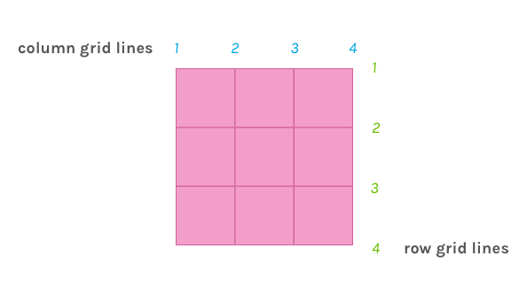
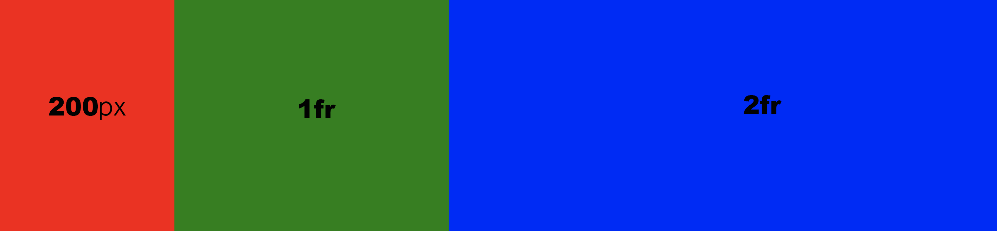
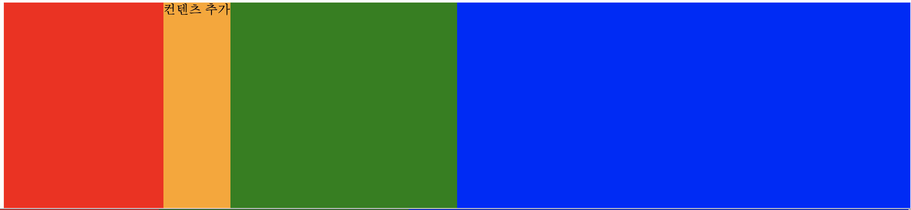
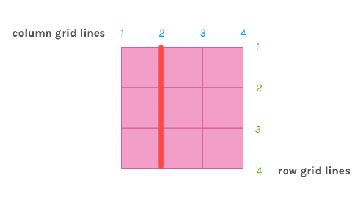
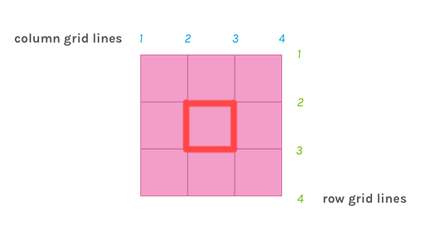

> 오늘은 새소식 section을 여러가지 방법으로 설계 해봤다. 처음 생각한 방법은 float를 이용한 방법이였지만 그 외에도 flex또는 absolute를 이용한 설계방식도 생각해보면서 최대한 다양한 관점에서 바라보도록 노력했다. 결국 마지막에는 이 고정형 레이아웃 웹 카페에서 아직 한번도 사용하지 않았던 grid를 이용한 방법을 채택했다.  

## GRID란 무엇인가

- 격자 구조를 만드는 행과 열, 모듈로 구성 - [Grid Layout GuidBook](https://uid.gitbook.io/css-grid/)
- 비율을 자율자제로 변경시키고 레이아웃의 균형을 쉽게 맞출수 있음.
- 예전에는 table을 사용해 레이아웃을 잡기도 했는데 table을 사용하면 depth가 깊어져 사용성이나 접근성면에서 좋지않았는데 그런 부분을 보완한게 css grid.  
- 다양한 디바이스에 최적화된 인터페이스를 미디어쿼리와 함께 사용하여 쉽게 제공할수있음
- 단점은 인터넷 익스플로러에서 지원하지 않는 관련 속성이 많다는 점.

## Grid 와 Flexbox 의 차이점


- 가장 큰 차이점은 flexbox는 1차원적인 정렬 (row 또는 column)에 적합하다면 css grid는 2차원 방향으로 (동시에) 배치 또는 정렬이 가능하다는 점. 
- 두가지 방법 모두 유용하기 때문에 상황에 맞게 쓰면 됨 
(열이나 행에 대한 1차원 정렬은 flexbox, 열과 행에 두가지 모두를 고려한 레이아웃을 구사할때는 grid).


### 관련용어 / 속성

<strong>Grid</strong> - 행(rows) 과 열(columns)를 가지며 그리드 아이템을 배치할수 있음
`display: grid`속성을 사용하면 요소가 grid container가 되며 자식요소는 그리드 아이템이 되어 배치됨. 

그리드 속성을 제대로 사용하기 앞서 템플렛을 설정해줘야하는데 행은 grid-template-rows , 열은 grid-template-column을 이용하면 됨.



이런 식으로 3x3 모든 셀이 균등한 그리드 템플릿을 만들고 싶다면, 

```css
grid-template-rows: repeat(3, 1fr); /*1fr 1fr 1fr*/
grid-template-column: repeat(3, 1fr); /*1fr 1fr 1fr*/
/*동일한 너비를 가진 열이나 행을 만들고 싶다면 repeat를 사용해 여러번 반복가능 */
```

여기서 1fr는 1fraction을 뜻하며 그리드 컨테이너 내의 공간 비율을 분수로 나타내는 방법. 여기서 1fr 대신 repeat(3, 33%)를 쓸수도 있지만 1fr을 사용해 각각의 열과 행이 1/3을 차지한다는걸 명시해주는게 더 정확함.

하지만 꼭 fr을 써야하는건 아니고 상황에 맞게 여러개를 함께 써야할때도 있음.

예를 들어 `grid-template-columns: 200px auto 1fr 2fr;`를 이용해 grid를 만들고 각자의 요소에게 색깔을 입혀보면 아래와 같이 나오게 됨.

그전에 각자의 요소에게 그리드 영역을 설정해줘야함

[codepen](https://codepen.io/minki607/pen/KKMQrqp)에서 보기




이런식으로 첫번째 column은 고정값으로 200px를 갖게되고 2번째는 auto지만 컨텐츠가 없기 때문에 너비를 할당 받지 않음. 3번째 column 은 남은 공간중 1/3을 차지하고 4번째는 2/3을 차지하게 됨.
}


만약 auto값을 할당한 두번째 column에 컨텐츠가 추가된다면 그만큼이 늘어나고 나머지 column은 남은 자유공간의 1/3 과 2/3 을 각각 할당 받게됨.

 


<strong>Grid Line</strong> - Grid를 그리는 가로/세로 선. Grid 아이템을 배치하는 기준이 됨.
            예) `grid-column-start: 2;` 여기서 2는 두번째 컬럼을 가르키는게 아니고 gridline을 가르킴 




<strong>Grid Cell(Unit)</strong> -  4개의 그리드 라인으로 그려지는 공간(블록)




위 예제와 같이 중앙에 있는 grid-cell에 요소를 배치 시키고 싶다면

```css
  grid-column-start: 2;
  grid-column-end: 3;
  grid-row: 2;
  grid-row: 3;
```

셀단위를 선택할때는 start나 end중 하나만 명시해줘도 작동하기 때문에 이런 표기법도 가능하다.

```css
  grid-column-start: 2; /*또는 grid-column-end: 3*/
  grid-row-start: 2; /*grid-column-end: 3*/
```

단축 표기법으로는, `grid-area: grid-row-start, grid-column-start, grid-row-end, grid-column-end`를 사용하면 된다. 이 속성은 하나의 cell을 선택할때보단 여러 셀이 합쳐진 영역을 나타낼때 많이 쓰인다.  

```css
  grid-area: 2 / 2/ 3 / 3;
``` 

Grid Gutters - 행 또는 열 사이의 간격. 

```css
  grid-gap: 10px; /*행과 열사이에 10px의 간격이 추가됨*/
```
 행과 열 각각 다른 간격을 주고싶다면 아래와 같이 단일 속성을 사용해주면 됨. 
```css
  grid-row-gap: 5px;
  grid-column-gap: 10px;
  ```


